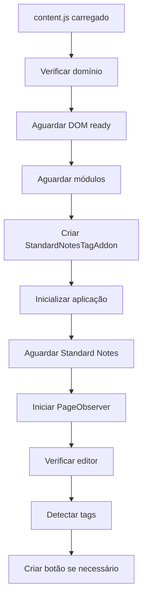

# 🏗️ Arquitetura Modular - Standard Notes Tag Addon v2.2.0

## 📁 Estrutura do Projeto

```
standard-notes-tag-addon/
├── src/                              # Código fonte modular
│   ├── config.js                     # Configurações centralizadas
│   ├── content.js                    # Ponto de entrada principal
│   ├── utils/                        # Utilitários compartilhados
│   │   ├── logger.js                 # Sistema de logging
│   │   └── dom-utils.js              # Utilitários DOM
│   └── modules/                      # Módulos especializados
│       ├── tag-detector.js           # Detecção de tags
│       ├── content-inserter.js       # Inserção de conteúdo
│       ├── ui-button.js              # Interface do botão
│       ├── page-observer.js          # Observação da página
│       └── app-controller.js         # Controlador principal
├── styles.css                        # Estilos CSS
├── manifest.json                     # Manifest da extensão
├── icons/                            # Ícones da extensão
├── build/                            # Builds de produção
└── mozilla-submission/               # Arquivos para Mozilla
```

## 🧩 Módulos e Responsabilidades

### 🔧 **src/config.js**
- **Responsabilidade**: Configurações centralizadas
- **Conteúdo**: Todas as configurações da aplicação
- **Uso**: Acessível via `window.SNTagAddonConfig`

### 📝 **src/utils/logger.js**
- **Responsabilidade**: Sistema de logging consistente
- **Funcionalidades**:
  - Logs estruturados com prefixo
  - Controle de debug mode
  - Diferentes níveis de log
- **Uso**: `window.SNLogger.log('mensagem')`

### 🛠️ **src/utils/dom-utils.js**
- **Responsabilidade**: Utilitários para manipulação DOM
- **Funcionalidades**:
  - Debounce de funções
  - Sanitização de texto
  - Manipulação segura de HTML
  - Seleção de elementos
  - Espera por elementos
- **Uso**: `DOMUtils.debounce(func, delay)`

### 🏷️ **src/modules/tag-detector.js**
- **Responsabilidade**: Detecção e extração de tags
- **Funcionalidades**:
  - Múltiplos métodos de detecção
  - Validação de tags
  - Priorização inteligente
  - Criação de blocos de localização
- **Classe**: `TagDetector`

### ✍️ **src/modules/content-inserter.js**
- **Responsabilidade**: Inserção de conteúdo no editor
- **Funcionalidades**:
  - Compatibilidade com Lexical Editor
  - Múltiplos métodos de inserção
  - Remoção de duplicatas
  - Limpeza de conteúdo
- **Classe**: `ContentInserter`

### 🎨 **src/modules/ui-button.js**
- **Responsabilidade**: Interface do botão
- **Funcionalidades**:
  - Criação e posicionamento dinâmico
  - Estados visuais
  - Reposicionamento inteligente
  - Event handling
- **Classe**: `UIButton`

### 👁️ **src/modules/page-observer.js**
- **Responsabilidade**: Observação da página e navegação
- **Funcionalidades**:
  - MutationObserver otimizado
  - Detecção de navegação SPA
  - Limpeza automática
  - Verificação periódica
- **Classe**: `PageObserver`

### 🎮 **src/modules/app-controller.js**
- **Responsabilidade**: Controlador principal da aplicação
- **Funcionalidades**:
  - Coordenação de todos os módulos
  - Lógica principal da aplicação
  - Gerenciamento de estado
  - Inicialização e cleanup
- **Classe**: `StandardNotesTagAddon`

### 🚀 **src/content.js**
- **Responsabilidade**: Ponto de entrada principal
- **Funcionalidades**:
  - Carregamento de módulos
  - Inicialização da aplicação
  - Validação de domínio
  - Cleanup global

## 🔄 Fluxo de Inicialização



## 🎯 Vantagens da Arquitetura Modular

### ✅ **Manutenibilidade**
- Código organizado em módulos especializados
- Responsabilidades bem definidas
- Fácil localização de bugs

### ✅ **Testabilidade**
- Módulos independentes
- Fácil criação de unit tests
- Dependências explícitas

### ✅ **Escalabilidade**
- Fácil adição de novos módulos
- Modificações localizadas
- Reutilização de código

### ✅ **Performance**
- Carregamento otimizado
- Debouncing automático
- Observação eficiente

### ✅ **Debugging**
- Logs estruturados
- Estados rastreáveis
- Ferramentas de debug

## 🛠️ Desenvolvimento

### **Adicionar Novo Módulo**
1. Criar arquivo em `src/modules/`
2. Definir classe com responsabilidade específica
3. Exportar para `window`
4. Atualizar `manifest.json`
5. Integrar no `app-controller.js`

### **Modificar Configuração**
1. Editar `src/config.js`
2. Usar `window.SNTagAddonConfig` nos módulos
3. Centralizar todas as configurações

### **Debug**
1. Ativar debug mode em `config.js`
2. Usar `window.SNLogger` para logs
3. Acessar `window.SNTagAddonInstance` no console

### **Testar**
1. Carregar extensão temporária
2. Verificar console para logs
3. Testar funcionalidades individualmente

## 📈 Métricas de Qualidade

### **Antes da Refatoração**
- **Linhas de código**: ~1736 (um arquivo)
- **Módulos**: 1 arquivo monolítico
- **Responsabilidades**: Misturadas
- **Testabilidade**: Baixa
- **Manutenibilidade**: Difícil

### **Após Refatoração**
- **Linhas de código**: ~1500 (distribuídas)
- **Módulos**: 9 arquivos especializados
- **Responsabilidades**: Bem definidas
- **Testabilidade**: Alta
- **Manutenibilidade**: Excelente

## 🎉 Resultado

A refatoração transformou um arquivo monolítico de 1736 linhas em uma **arquitetura modular robusta** com:

- **9 módulos especializados**
- **Configuração centralizada**
- **Sistema de logging avançado**
- **Separation of Concerns perfeita**
- **Facilidade de manutenção e teste**
- **Performance otimizada**

---

**🚀 Arquitetura pronta para produção e futuras expansões!**
